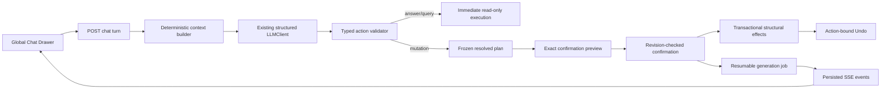

# Global Chat and Dashboard Capabilities Design

**Status:** Approved for implementation planning on 2026-08-20. The user ended the interview and directed the remaining open choices to use the recommended defaults.

## Purpose

Extend the semantic dashboard from independent card questions into a global, persistent assistant that can answer questions about visible results, propose dashboard changes, generate dashboards, and safely undo its work. The visualization remains the primary evidence surface. Chat may help users navigate or change it, but must not become an unverified alternate source of truth.

## Delivery approach

Three approaches were considered:

1. **Trust-first vertical slices (selected).** Finish the remaining tabs/export work, introduce migrations and a read-only chat foundation, add frozen confirmation plans and reversible actions, then add resumable generation and evals. Every phase leaves working, testable software and no phase exposes mutation without confirmation and Undo.
2. **Follow the source roadmap literally.** Build broad chat dispatch before confirmation, migration, and Undo. This reaches more actions sooner but creates an unsafe intermediate product and forces storage interfaces to be rewritten.
3. **One integrated release.** Implement every capability behind one long-lived branch. This avoids temporary interfaces but makes regressions, review, and rollback much harder.

The selected approach is intentionally incremental. It preserves the current `/ask` and `/query` behavior while the new chat path is developed behind a disabled-by-default feature flag.

## Scope

### Included

- Finish Stage 1 by making dashboard tabs reorderable and moving PNG/CSV/JSON into dedicated `Export` menus.
- A browser-global conversation spanning every dashboard.
- A closed-by-default, resizable right drawer that overlays the board unless pinned.
- Explicit server permission and per-browser consent before visible row data enters chat context.
- Typed model actions, deterministic validation, exact mutation previews, confirmation, transactional application, and action-bound Undo.
- Read-only transient queries with the full trust surface and a confirmed “Add as card” action.
- Dashboard/card creation, refinement, layout, rename, reorder, and soft deletion through chat.
- Model-proposed card coordinates that are clamped and resolved by the server into a collision-free 12-column layout.
- Streaming generation with two concurrent card workers, resumable progress, Stop, deterministic retry, and partial-success placeholders.
- Source-linked and deterministically verified numeric claims.
- Backend/frontend tests and a free-provider live chat eval suite.

### Excluded

- Raw model-authored SQL, semantic-layer joins outside the declared grammar, new metric persistence, cross-device identity, authentication, collaboration, transcript search, and dashboard import.
- Persisting the row context sent to a model. Only short-lived transient-query cache entries may contain rows.
- Silent provider changes or silent paid-provider fallback.
- Changing existing per-card refinement history: `/ask` remains history-free and keeps its one-step card Undo.
- Changing existing direct menu deletion semantics. Direct deletion remains permanent; only chat deletion is soft and reversible.

## Current state and Stage 1 closure

The branch already contains board create/rename/delete routes, ordered `position` values, active-tab persistence, card/board export helpers, and board-scoped layout persistence. Two gaps remain:

- `frontend/src/components/TabBar.tsx` displays ordered tabs but never calls `api.reorderBoards()`.
- Card PNG/CSV are mixed into the overflow menu with removal, while board PNG/JSON sit beside the primary New card action.

Stage 1 closes those gaps. Tabs use pointer and keyboard sorting with an explicit drag affordance, live reordering, rollback on API failure, and screen-reader announcements. Each card gets a dedicated `Export ▾` at the far right of its header with PNG and CSV. The masthead gets a separate active-dashboard `Export ▾` with PNG and JSON. The large New card control remains at the upper left. Export JSON version 1 is documented in `docs/design.md`.

## System architecture



The model decides intent inside a closed grammar. It does not apply effects. The server converts model intent into an authoritative plan, validates ownership and current revisions, resolves layout collisions, and stores that frozen result. Confirmation never calls the planning model again.

## Persistence and migrations

A small sequential raw-SQL migration runner replaces the current “reset the volume for schema changes” limitation. At backend startup, before application pools open, it connects through `ADMIN_URL`, acquires one transaction-scoped PostgreSQL advisory lock, creates `app.schema_migration` if needed, validates checksums for applied migrations, and applies each unapplied numbered file in one transaction. Transaction-level advisory locks are automatically released at transaction end, which is appropriate for startup serialization. Migration files may not contain statements such as `CREATE INDEX CONCURRENTLY` that cannot run in the enclosing transaction.

The fresh-install SQL and migrations converge on this model:

- `app.board`: add `revision bigint NOT NULL DEFAULT 0` and `deleted_at timestamptz`.
- `app.card`: add `deleted_at timestamptz`.
- `app.chat_thread`: opaque browser thread ID and timestamps.
- `app.chat_message`: global transcript entries with `thread_id`, role, body JSON, active-dashboard label/ID at the time, `data_exposed`, and timestamp. It never stores row context.
- `app.chat_plan`: the single pending frozen mutation plan for a thread, its basis revisions/layer fingerprint, authoritative preview, status, and timestamps.
- `app.chat_action`: confirmed action state, optional thread link, provider/model, effects journal, status, cancellation flag, affected dashboard, and purge timestamp. Clearing a thread detaches completed actions instead of cascading them so deletion integrity can outlive visible history for at most 30 days.
- `app.chat_action_item`: ordered generated-card requests and their placeholder/card/error status.
- `app.chat_event`: monotonically ordered, schema-versioned action events used to replay an SSE subscription after `Last-Event-ID`.
- `app.chat_transient_result`: a short-lived 15-minute cache envelope for a read-only chat query. Expired rows are deleted opportunistically and the transcript retains only the semantic query, summary, and cache ID.

Normal board/card reads exclude `deleted_at IS NOT NULL`. Chat deletion marks rows; chat Undo restores them. Existing direct delete routes use explicit hard-delete store functions. Chat cannot delete the final visible dashboard. Deleting the active dashboard selects the nearest surviving tab.

Every semantic, membership, title, ordering, or layout mutation increments the affected board revision. Cache refreshes do not. A pending plan records affected board revisions, the ordered board-list fingerprint, and a semantic-layer fingerprint. Confirmation returns `409 stale_plan` when any basis differs and offers regeneration; it never applies a stale subset.

## Chat identity, lifecycle, and configuration

The server creates a cryptographically random thread ID. The browser stores it in `localStorage`; this provides per-browser persistence but deliberately does not claim authenticated ownership or cross-device sync. Only one pending mutation plan may exist for a thread. Read-only questions may continue while one is pending, but another mutating request must confirm or cancel it first.

Initial settings are:

```text
CHAT_ENABLED=false
CHAT_SEES_DATA=false
CHAT_MAX_ROWS=2000
CHAT_MAX_CONTEXT_CHARS=60000
CHAT_HISTORY_TURNS=6
CHAT_TRANSIENT_TTL_SECONDS=900
CHAT_TOMBSTONE_DAYS=30
```

Clearing the conversation cancels running work and pending plans, deletes visible transcript records, rotates the browser thread ID, and leaves completed dashboard state unchanged. Minimal tombstone/effect records needed to avoid corrupting deletion integrity are excluded from model context and purged after 30 days.

## Data visibility and deterministic context

Row sharing requires both gates:

1. Deployment setting `CHAT_SEES_DATA=true`.
2. A visible per-browser “Share visible data with the selected model” opt-in, off by default and remembered locally.

When either gate is off, the model receives dashboard/card structure, semantic restatements, row counts, freshness, and layer grammar, but no result values. The system prompt requires refusal of value questions and offers to build a card. Turning sharing off keeps prior messages visible but excludes every `data_exposed=true` turn from future prompts.

Context construction is deterministic and separated from persistence:

- All dashboards contribute title, ordering, and structural card summaries.
- Only the active dashboard may contribute detailed rows.
- Every card always receives a deterministic summary: row count, per-column type, min/max/total where meaningful, and top five rows by its leading measure.
- Exact rows are admitted in this order: explicitly referenced cards, the currently selected card, cards whose normalized titles appear in the message, then layout order.
- Both the 2,000-row ceiling and the 60,000-character ceiling apply. When either would be exceeded, remaining cards keep only summaries and the assistant response discloses that fact.
- At most six eligible global turns enter the user block, labeled with their dashboard. The byte-stable system prompt contains no board state, history, rows, or date.
- After a dashboard switch, an ambiguous phrase such as “that chart” produces a clarification rather than guessing.

The existing query path remains absolute: the model sees only the semantic layer and current semantic query during refinement. Chart generation sees rows but uses no model. Documentation will state these three boundaries separately.

## Typed action protocol

The provider seam remains `LLMClient.ask(system, user, schema)`. Because that seam accepts a `BaseModel` class, a strict `ChatModelResponse` wrapper carries one `turn` field whose value is a Pydantic `Annotated` discriminated union on the literal `action` field. Separate variants prevent combinations such as an `answer` containing a layout or a deletion without a target without changing any provider adapter.

Read-only variants are `answer`, `run_query`, `clarify`, and `refuse`. Mutating variants are `new_cards`, `edit_card`, `new_dashboard`, `layout`, `rename_dashboard`, `reorder_dashboards`, `delete_card`, and `delete_dashboard`.

When the requested metric is outside the curated layer, `refuse` names the missing metric and presents the original request as copyable text. It does not write a backlog record; metric-request persistence is deferred.

`CardRequest` contains a stable request ID, natural-language question, title, optional chart hint, and optional raw `{x,y,w,h}`. It does not contain SQL. Each generation request is independently routed through the existing `query_step.ask()`, semantic validation, compiler, warehouse read-only role, renderer, and confidence gate. `edit_card` is different: it contains the complete replacement `SemanticQuery` and chart hint, so the confirmation preview can show the exact deterministic query diff and confirmation does not need a second planning call.

Inactive dashboards permit only explicit structural rename, reorder, and confirmed deletion. Data questions, card creation, card editing, and data-dependent layout require the target dashboard to be active.

## Planning, confirmation, and effect application

Pure answers and read-only queries execute immediately. Every mutation instead follows this flow:

1. Validate the model action and target ownership.
2. Resolve raw layout requests into exact collision-free coordinates.
3. Calculate a frozen effect list and authoritative miniature-dashboard preview.
4. Store one pending plan with its revision basis.
5. Let the user confirm or cancel that exact plan.
6. On confirmation, recheck revisions and apply without another planning call.

Structural multi-operation plans are all-or-nothing PostgreSQL transactions. Generated dashboards are the documented exception: board and placeholders are created atomically, then individual card workers may succeed or fail. Successful cards remain; failures become retryable/removable placeholders. A retry uses the frozen `CardRequest`, original provider/tier, current layer validation, and never silently switches provider.

Model coordinates are clamped to the 12-column grid and minimum/maximum size rules. The server searches for the nearest collision-free location in every direction, using displacement and direction only as deterministic tie-breakers. It extends downward only if no bounded opening exists. Preview and application use the same resolved structure.

## Generation, streaming, Stop, and recovery

Confirmation creates the action and placeholders before workers start. A generation manager runs at most two card requests concurrently. Its database state, rather than an open HTTP connection, is the source of truth; collapsing the drawer or losing the connection does not stop work. Startup resumes queued/running items from their frozen requests.

Clients subscribe to `GET /chat/actions/{action_id}/events`, which returns `text/event-stream`. Persisted monotonically increasing event IDs allow native `EventSource` reconnection through `Last-Event-ID`. Events are `plan`, `item_started`, `card`, `item_failed`, `stopped`, and `done`; a heartbeat comment is emitted every 15 seconds. An explicit Stop endpoint marks cancellation, workers check it between blocking calls, completed items remain, and unfinished placeholders become cancelled.

## Numeric verification and provenance

Numeric prose is represented as structured claims rather than trusted free text. Each claim declares an operation (`exact`, `rounded`, `sum`, `difference`, `ratio`, `percentage`, or `percentage_change`) and source operands identified by card, field, and dimension keys. The server resolves operand values from current visible rows, recomputes the operation with decimal arithmetic, and compares it to the displayed figure using explicit rounding tolerance.

The `say` field may contain navigation and explanation but is rejected or scrubbed if it introduces numeric literals outside claims. Verified claims render with source chips. Clicking a chip activates the dashboard, scrolls to the source card, and briefly highlights it. An unverifiable numeric sentence is removed from confident prose and replaced with a plain statement that the number could not be verified from visible card data.

## Transient queries

`run_query` executes through the existing validated semantic pipeline and returns a compact chart/table result, deterministic restatement, row count, freshness, and collapsible compiled SQL. It is not a mutation and needs no confirmation. “Add as card” creates a frozen mutation plan and does.

Rows live only in the 15-minute transient cache. After expiry or reload without a live cache entry, the transcript shows the query summary and an explicit “Run again” control. It never silently reruns the warehouse.

## Frontend experience

The chat drawer is owned by `App.tsx`, not `Board.tsx`, because its conversation and provider selection span tabs. A masthead button and `Ctrl/Command+Shift+A` toggle it. The browser remembers closed/open, width, pinned state, provider, and data consent. It opens closed on a new browser. Overlay mode leaves the dashboard geometry unchanged; pinning reduces available viewport width and triggers normal chart resizing without persisting new grid coordinates.

The selected provider is browser-global and applies to chat, new cards, and refinement. “Stronger model” is per submission. If the selected provider maps both tiers to the same model, the toggle is disabled with an explanation. There is no provider fallback.

Mutation messages show an operation checklist and exact mini-grid preview with Confirm and Cancel. Completed mutation messages retain Undo bound to that exact action and dashboard even after tab switches; the dashboard header’s Undo remains scoped to the active dashboard. Source-chip activation and generated-dashboard creation use `App` callbacks rather than global DOM queries.

## APIs

The planned API surface is:

- `POST /chat/threads`, `GET /chat/threads/{thread_id}`, `DELETE /chat/threads/{thread_id}`.
- `POST /chat/threads/{thread_id}/turns` for one structured planning/answer call.
- `POST /chat/plans/{plan_id}/confirm` and `/cancel`.
- `GET /chat/actions/{action_id}/events` for resumable SSE.
- `POST /chat/actions/{action_id}/stop`, `/undo`, and `/items/{item_id}/retry`.
- `POST /chat/transient/{result_id}/rerun` and `/add` where `/add` creates a pending plan rather than mutating immediately.

All JSON endpoints use response models. The SSE route declares `StreamingResponse` and `text/event-stream` in OpenAPI. Event payloads are schema-versioned JSON.

## Error behavior

- Schema or semantic validation gets the existing single correction attempt; a second miss becomes a clear refusal.
- `LLMRateLimited` remains distinct and is caught before `LLMError`. UI calls fail promptly; live evals may back off.
- Missing credentials and stronger-tier unavailability are visible; no provider substitution occurs.
- Stale pending plans return `409` and are never partially applied.
- Context truncation is disclosed in the answer.
- A generation item failure never poisons sibling cards.
- Network loss affects only the subscription; persisted job state remains recoverable.
- Direct manual deletion of a referenced card leaves a dead source chip rather than rewriting history.

## Testing and evaluation

Unit and integration tests use fake `LLMClient` instances and make no provider API calls. Backend coverage includes migrations/checksums, global transcript storage, both consent gates, deterministic context ordering and byte/row ceilings, data-derived history exclusion, every action variant, revision invalidation, transactionality, layout resolution, last-dashboard protection, soft-delete/Undo, claim arithmetic, transient expiry, two-worker generation, recovery, Stop, retry, and SSE replay.

Frontend coverage includes accessible tab sorting, export-menu placement, thread creation/rotation, drawer persistence/pinning, browser-global provider state, disabled stronger tier, consent copy, source navigation, exact confirmation preview, stale-plan recovery, action-bound Undo, transient rerun, stream reconnection, partial generation, and Stop.

The live chat eval adds action accuracy, query accuracy, refusal/clarification accuracy, and generated-card-count scoring. It uses DeepSeek through NVIDIA first and Gemini second when configured. If neither free provider is available, it stops with instructions; it never silently runs Anthropic or OpenAI. Paid providers may be selected only through an explicit CLI flag.

## Documentation sources and allowed APIs

- Pydantic’s documented `Field(discriminator="action")`/`Annotated` discriminated-union pattern and `ConfigDict(extra="forbid")` are allowed. Untagged union guessing and permissive extra fields are not.
- Psycopg connection/transaction context managers are allowed for atomic application; open-ended transactions and manual partial commits are not.
- PostgreSQL `pg_advisory_xact_lock` is allowed for migration serialization. Session locks and nontransactional migration files are not.
- FastAPI `StreamingResponse` with an async generator is allowed for SSE. The generator must await regularly so cancellation/cleanup can run.
- WHATWG SSE `id`, `event`, `data`, `Last-Event-ID`, `text/event-stream`, and 15-second comment heartbeats are allowed. Invented reconnection headers are not.
- dnd-kit’s `DndContext`, pointer/keyboard sensors, `SortableContext`, `useSortable`, `arrayMove`, and `sortableKeyboardCoordinates` are allowed for tabs. Pointer-only HTML drag is not acceptable.

## Success criteria

- Tabs reorder and persist through reload; exports sit in dedicated right-side menus.
- Chat is global, closed by default, and recoverable across dashboard switches and reloads.
- No visible result row reaches an LLM without both server permission and browser consent.
- No mutation occurs before the exact frozen preview is confirmed.
- Stale plans do nothing, structural plans are atomic, and every chat mutation has correctly targeted Undo.
- Generated dashboards fill progressively with at most two concurrent workers, survive drawer closure, and recover after reconnect/restart.
- Every displayed numeric claim is deterministically verified or clearly withdrawn.
- Query/refinement security invariants remain unchanged, and live model tests use free providers unless the operator explicitly chooses otherwise.
